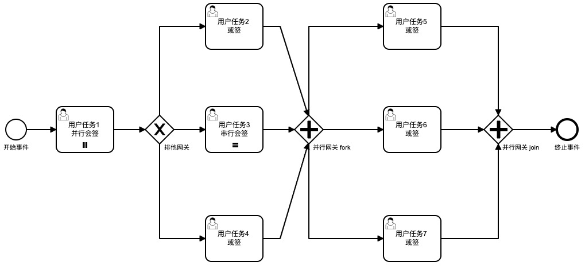
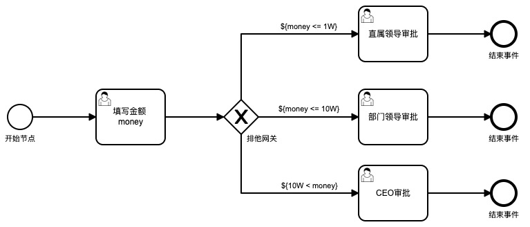
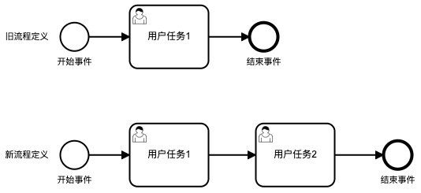
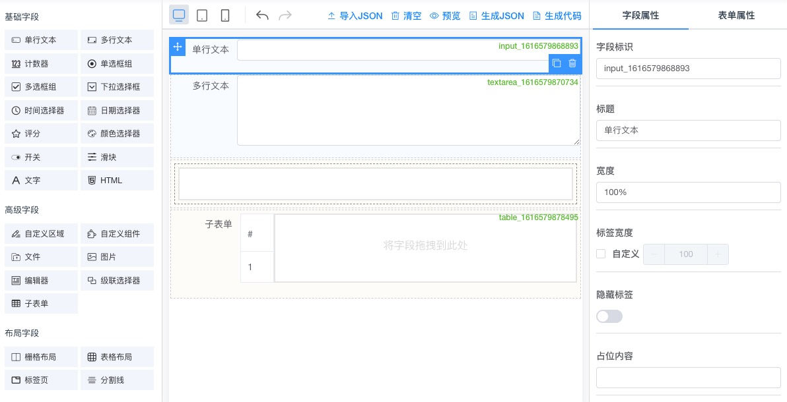

在开始之前，首先需要明确工作流这个领域中的几个概念：流程、流程定义、流程实例、任务、表单。

1. 流程（Process）：`流程`是一个比较宽泛的概念，这个词其实既可以表示`流程定义`，也可以表示`流程实例`。举个例子，我们说`新建一个流程`时，其实说的是`新建一个流程定义`；而我们说`发起一个流程`时，其实说的是`发起一个流程实例`。在实际交流中，`流程`这个词用来指代我们一般理解的工作流，我们需要用`流程定义`和`流程实例`这两个更为准确的词来描述业务场景。
2. 流程定义（Process Definition）：`流程定义`用来描述一个流程的结构，其中包含开始节点、中止节点、网关节点、任务节点等元素。`流程定义`可以类比成 Java 中类的概念，是静态的数据。
3. 流程实例（Process Instance）：`流程实例`是就相当于是`流程定义`的一次执行，它相当于 Java 中的对象的概念，一个类可以生成多个对象，每个对象都有自己独有的属性。类似的，一个`流程定义`可以有多个`流程实例`，每个`流程实例`都有自己的参数值、人员信息等。因此，不同的流程实例在同一个流程定义上对应的执行走向可能是不一样的。
4. 任务（Task）：`任务`是`流程实例`在流转过程中产生的东西。在工作流这个领域中，常常出现一个流程流转到某个节点，然后需要这个节点上的人员执行相关的操作，这个相关的操作指的就是`任务`，它是`流程实例`流转过程中产生的。
5. 表单（Form）：`表单`是挂靠在节点上的，属于静态数据，在`流程定义`中需要指定某个节点上拥有哪些`表单`。表单中的数据是每个流程实例所特有的，比如发起一个报修流程实例的时候需要填写相关的报修数据，不同的报修流程实例的报修数据可以是不一样的。

## 一、流程定义

### BPMN2.0

BPMN2.0 是 BPMN 的 2.0 版本，BPMN 的全称是 Business Process Model and Notation，即业务流程建模符号，它是工作流这个领域里面最权威的一个规范，其中包含了一个工作流中可能涉及到的全部内容。简单来说，一个`流程定义`就是一张流程图，只要我们画出了这张流程图，那么流程定义就相当于已经生成好了。BPMN 的作用，就是用来规定这张流程图中可以画哪些元素，元素与元素之间应该如何连接，它可以理解为是一个画流程图的规范。如下是 BPMN 中的支持的各种元素：


如上，BPMN2.0 中提供了丰富的元素，在定义了这套规范之后，不同的公司就能根据这套规范去研发基于 BPMN2.0 的流程引擎，常见的基于 BPMN2.0 研发的开源流程引擎有 Activiti/Camunda/Flowable，各种开源流程引擎相关的对比可见[这里](https://www.cnblogs.com/garfieldcgf/p/13469519.html)。我们采用的是 Camunda，它提供了 Camunda Modeler 来绘制符合 BPMN2.0 规范的`流程定义`，同时在其中提供了各种扩展的 Camunda 参数。

### 节点元素

BPMN2.0 中定义了多种流程元素，但是在工单系统中，用不到这么多的元素，只需要以下几种即可：

1. 开始事件（startEvent）：事件的一种，表示流程实例的开始。
2. 终止事件（endEvent）：事件的一种，表示流程实例的结束。
3. 顺序流（sequenceFlow）：连接对象的一种，用带实心箭头的实心线表示，它描述了节点之间的执行顺序。连接对象上可以有条件，条件上可以根据变量值来判断，可以配合网关使用。
4. 用户任务（userTask）：活动的一种，流程实例流转过程中走到该节点上时会产生一个任务（Task），用户可以在该节点上进行相关操作并提交任务。
5. 排他网关（exclusiveGateway）：网关的一种，流程流转过程中会按顺序计算与此关联的全部`出顺序流`，只要出现一个`出顺序流`出现 true，则流程就会被流转，其余`出顺序流`将不会被计算；如果没有`出顺序流`计算为 true，则会出错，详见[这里](https://docs.camunda.org/manual/latest/reference/bpmn20/gateways/exclusive-gateway/)。
6. 并行网关（parallelGateway）：网关的一种，所有与该网关关联的出顺序流上的条件均会忽略，这种网关一般用来控制多个分支的分发与合并，详见[这里](https://docs.camunda.org/manual/latest/reference/bpmn20/gateways/parallel-gateway/)。

以下就是用到上述全部元素的一张流程图（仅做展示，忽略流程图的含义）：



图中的用户任务分为三种：并行会签、串行会签以及或签，三者的定义如下：

1. 并行会签：任务节点上挂靠了多个人，流程实例流转到该任务节点后，每个人都会同时被分配到只属于自己的任务，相当于是并行操作。当所有人都提交任务之后，流程实例才会往下走。
2. 串行会签：任务节点上挂靠了多个人，流程实例流转到该任务节点后，只有第一个人会被分配任务，当他执行完后，该任务节点上的下一个人才会收到任务，相当于是串行操作。当所有人都提交任务之后，流程实例才会往下走。
3. 或签：任务节点上挂靠了多个人，流程实例流转到该节点后，处于该节点上的每个人会被分配到同一个任务，当任意一个人提交任务之后，流程实例就会往下走。

### 节点属性


节点属性是用来描述节点上的一些扩展信息的，如：

1. `开始事件`这个节点上可以挂靠表单，这个表单信息就属于节点的属性。

2. `用户任务`这个节点上可以设置用户的操作按钮，不同角色的用户看到的按钮是不一样的，这也可以通过配置节点的属性来实现，如下，`roleId = 12345` 的用户在这个节点能够看到`保存/关闭/转派/完结`四个按钮，而 `roleId = 67890` 的用户在这个节点只能够看到`转派/提交`两个按钮。

   ```json
   [
       {
           "roleId":"12345",
           "buttonList":[
               "保存",
               "关闭",
               "转派",
               "完结"
           ]
       },
       {
           "roleId":"67890",
           "buttonList":[
               "转派",
               "提交"
           ]
       }
   ]
   ```

简单来说，一切对节点信息的描述都可以通过配置节点属性的方式来实现，节点属性可以让我们很方便的实现一些扩展的功能。

### 节点变量



节点属性是常量，相当于是静态数据，而节点变量是动态数据。以上图为例，在`填写金额`节点存在一个变量`money`，在不同的流程实例中，这个变量的值可能是不同的。比如有的流程实例中填写的金额是 5W，那么它走的就是`部门领导审批`这个节点；有的流程实例填写的金额是 15W，那么它走的就是`CEO审批`这个节点。由此可见，变量是被声明在`流程定义`中的，而变量值是属于`流程实例`的数据，不同的流程实例，对应的变量值可能是不同的。节点变量可以说是串联起了流程定义，流程实例，表单这几个核心的概念：

1. 节点变量是在流程定义中声明出来的。
2. 不同的流程实例在流转过程中都会往上下文中设置变量值，不同的流程实例有不同的变量值，不同的变量值决定了流程实例的流转过程。
3. 第 2 步中的变量值可以从表单数据中获取，然后塞入流程实例的上下文中。以上面的流程为例，用户填在表单上的金额是 1000，则在用户提交任务的时`("money",1000)`这个变量值就会被放到流程实例的上下文中。

综合以上，可以说节点变量赋予了流程实例生命力，因为它让不同的流程实例拥有不同的流转行为，理解节点变量这一概念很关键。同时，本系统做一个约定，所有的流程实例中的变量全部来自于表单中，且只有在用户节点上能够设置流程实例的变量。

### 版本控制



流程定义是有版本的概念的，流程定义的升级不应该影响基于旧版本流程定义发起的流程实例的流转。以上图为例，旧流程定义一共就三个节点，基于这个流程定义发起了流程实例 A。然后将该流程定义更新为 4 个节点并重新部署，此时流程实例 A 仍会按照原先三个节点的定义进行流程流转，不会受到影响。在 Camunda 中，通过 KEY_ 和 VERSION_ 这两个字段标识流程定义和版本，通过 KEY_ 和 VERSION_ 这两个字段来确定唯一的流程定义。

## 二、流程实例

流程实例就是基于`流程定义`的一次执行过程，流程实例在流程定义的基础上拥有了变量值，这些变量值组成了流程实例的上下文。不同的流程实例拥有不同的上下文，上下文中包含独属于当前流程实例的一些变量值，这些变量值会影响流程实例的流转，会影响任务的执行人等。为了概念的简单与清晰，需要做如下两个约定：

**约定一：流程实例的操作类型一共只有两种**

1. **发起流程实例（start）**

   ```java
   // camunda 中发起流程实例
   runtimeService.startProcessInstanceByKey(processDef.getProcDefKey(), paramMap);
   ```

2. **中止流程实例（stop）**

   ```java
   // camunda 中删除流程实例
   runtimeService.deleteProcessInstance(procInstId, comment);
   ```

后续可能还有其他类型的操作，目前只有这两种。

**约定二：流程实例可以拥有不同的业务状态，但是对应的流程实例的状态只有两种**

1. **进行中**：但凡流程实例没有走到终止事件，则该流程实例就处于进行中的状态。
2. **已结束**：流程实例走到终止事件。

虽然 Camunda 中对流程实例的状态还会有一些其他的划分，如挂起、异常结束等，但是我们这里约定流程实例的状态只有以上这两种。进行中和已结束这两种实例状态的划分在 Camunda 的数据表中也有体现，如 ACT_RU_XXX 的表都是用来存储状态为进行中的流程实例的数据，而 ACT_HI_XXX 的表用来存储全部流程实例的数据，包含进行中与已结束。

## 三、任务

虽然 BPMN2.0 中支持的任务有很多种，但为了概念的简单与清晰，做如下约定：

**约定一：本项目所说的任务指的就是用户任务（userTask）**

任务其实是就是 BPMN2.0 中的一种活动节点，虽然 BPMN2.0 中支持很多中活动类型，用户任务（userTask）其实是最常用的一种。我们约定任务指的就是用户任务。

**约定二：任务的操作类型只有以下两种**

1. **完成任务（complete）**：提交任务，将流程实例流转到下一个节点。
2. **更新变量值（update）**：只更新流程实例上下文中的变量值或者任务所属人，不操作任务并流转。

任务是流程实例流转过程中所产生的，操作任务会促使流程实例中发生流转，从而形成流程实例的操作记录。process_inst_operation 这张扩展表就是用来存储这部分操作记录的，里面扩展了一些额外的字段。

**约定三：任务上可以指派的人员类型只有以下四种**

1. **ID**：或签类型，存放的是人员或者角色的 id，由流程定义确定。简单来说，就是用户任务的执行人员在流程定义的时候就已经确定了，所有流程实例走到该任务节点时，这个任务的执行人都是一样的。
2. **PARAM**：或签类型，存放的是人员或者角色的变量值，由流程实例确定。不同的流程实例对应的该任务的执行人是不一样的，可以通过 setVariables 设置流程实例的上下文中的变量值来实现。变量值支持指定多个人员或者角色，但他们接收到的任务是同一个任务，即或签。
3. **PAR_MULTI_INSTANCE**：并行会签类型，存放的是人员或者角色的变量值。PAR_MULTI_INSTANCE 与 PARAM 的不同点在于它会为每个人员或者角色产生 1 个任务，而 PARAM 中只会有 1 个任务。
4. **SEQ_MULTI_INSTANCE**：串行会签类型。SEQ_MULTI_INSTANCE 与 PAR_MULTI_INSTANCE 的不同点在于它是串行的会签任务，多个任务之间是串行执行的，一个任务执行完后下一个任务才会被分配；而 PAR_MULTI_INSTANCE 的会签任务是同时生成的，任务之间是并行执行的。

**约定四：使用 candidateGroups 来存放约定三中的 ID 或者参数值**

Camunda 中提供了 assignee/candidateUsers/candidateGroups 这三个属性来存放人员的 id 或者变量值。由于 Camunda 中并不会校验人员这部分数据是否存在它的系统中，因此基于此我们可以集成自己的用户体系。我们约定不管是角色 id OR人员 id OR 变量名称，均用 candidateGroups 这个属性来存放。实际在使用的时候，可以看到 ACT_RU_IDENTITYLINK 这张表中会存放用户任务的执行人或角色的相关信息（均存放在 GROUP_ID_ 这个字段中）。

## 四、表单定义

为了概念的简单与清晰，做如下的约定：

1. 一个节点上可以挂靠多个表单，而一个表单只属于一个节点，节点与表单是一对多的关系。

2. 一个节点上的表单分为两种，一种是仅做展示的表单，一种是用于输入数据的表单，通过 display_form_ids 和 input_form_ids 这两个字段体现（位于 process_def_node 表中）。

3. 用于输入的表单中的数据可以作为变量值在提交任务（complete）或者更新参数（update）时传递到流程实例的上下文中。

4. 表单具有版本的概念，表单的更新不会影响到原先使用该表单的流程实例。

5. 表单是独立于流程存在的，表单中不存在流程的概念，表单与流程的关联关系是体现在流程中而不是表单中。

### 表单设计



以上是开源项目 [vue-form-making](https://github.com/GavinZhuLei/vue-form-making) 中的表单设计器，其背后其实就是一个 JSON 串，如下：

```json
{
    "list":[
        {
            "type":"input",
            "icon":"icon-input",
            "options":{
                "width":"100%",
                "defaultValue":"",
                "required":false,
                // 其余属性
            },
            "name":"单行文本",
            "key":"1616579868893",
            "model":"input_1616579868893"
        }
    ],
    "config":{
        "labelWidth":100,
        "labelPosition":"right"
        // 其余属性
    }
}
```

### 表单数据

表单数据准确的来说其实是属于流程实例的数据，这部分数据是由用户在 userTask 节点上填写的。我通过 process_inst_data 这张表来存储表单数据，以下是几个核心的字段：

```sql
instance_id  varchar(45) not null comment '流程实例id'
node_id      varchar(45) not null comment '当前录入表单所处的节点id'
form_id      varchar(45) not null comment '表单id'
form_data    text not null comment '流程实例在表单中对应的数据'
```

这些表示了流程实例（instance_id）在节点（node_id）上的表单（form_id）中填入的数据是 form_data。

### 表单数据与节点变量

在表单中不存在流程的概念，但是表单中的数据又可以在流程实例流转的过程中存放到流程实例的上下文中，所以需要建立表单数据与节点变量的这两者的关联关系。简单来说，在设计流程定义的时候，我们可以选择节点上的挂靠的表单，同时也可以指定在这个节点上需要传入流程实例上下文的变量名称（对应的变量值是由流程实例流转过程中填写在该表单上的数据决定的）。

基于此，我设计了 process_def_node_variable 这张表来存放表单与节点变量之间的关联关系，如下为几个核心的字段定义：

```sql
node_id       varchar(45)  not null comment '流程节点id'
variable_name varchar(45)  not null comment '流程节点的变量名称，这个参数可以在后续的节点中被引用'
java_type     varchar(45)  not null defalut 'java.lang.String' COMMENT '流程节点变量的类型'
form_id       varchar(45)  not null default '' comment '当前节点上挂靠的表单id'
field_id      varchar(45)  not null default '' comment '该表单中的字段id'
default_value varchar(255) not null default '' comment '默认的参数值'
```

这几个字段表示的含义是将节点（node_id）上的表单（form_id）中的字段（field_id）中存放的值作为变量名（variable_name）放到流程实例的上下文中，变量值的类型是 java_type。

### 表单版本控制

表单和流程定义一样，也存在版本的概念，表单版本的升级不会影响使用旧版本表单的流程实例提交数据与流转流程。在 form_structure 这张表中，通过 form_key 和 version 这两个字段唯一确定一张表单。

## 五、领域模型

### 流程分类

| 表名             | 作用     |
| ---------------- | -------- |
| process_category | 流程分类 |

### 流程定义

| 表名                      | 作用                                                         |
| ------------------------- | ------------------------------------------------------------ |
| process_def               | 流程定义                                                     |
| process_def_node          | 流程定义的节点信息，包含节点的人员设置                       |
| process_def_node_variable | 流程定义节点上的变量名与表单字段的关系，用于流转实例流转过程中的设置变量值 |
| process_def_node_property | 流程定义节点上的属性，用于扩展节点上的信息                   |

1. 整体表的设计思路是 camunda 中只负责管理流程的流转，其余所有的扩展属性均由 node_property 来存储，在 camunda 中不存储，这种方式的好处是在添加节点属性的时候不用重新部署流程。
2. 用 node_variable 来管理节点变量与表单数据的关联关系，采用这种方式的好处是能够动态的获取并设置流程实例中的参数而不用通过写死的方式去设置流程实例上下文的变量值。

### 流程实例

| 表名                   | 作用               |
| ---------------------- | ------------------ |
| process_inst           | 流程实例相关的信息 |
| process_inst_data      | 流程实例的表单数据 |
| process_inst_operation | 流程实例的操作信息 |

Task 的相关信息由 Camunda 来维护，扩展表中不负责维护这部分信息。

### 表单

| 表名           | 作用     |
| -------------- | -------- |
| form_structure | 表单结构 |

表单数据其实是流程实例的表单数据，因此，表单数据不属于表单这个聚合中，而是位于流程实例的聚合中，即 process_inst_data。